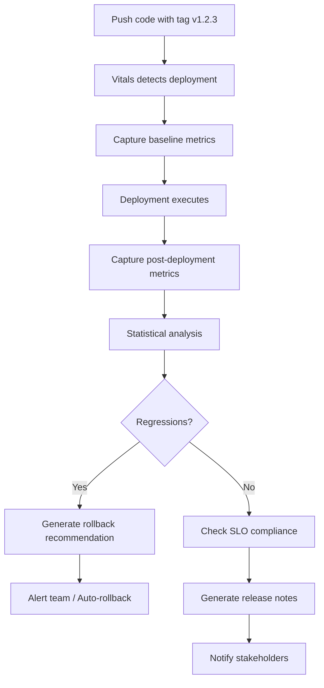

# CI/CD Integration & Deployment Intelligence

Vitals provides seamless integration with CI/CD pipelines to track deployment impact, enable intelligent rollbacks, and correlate code changes with production performance.

## Overview

The CI/CD Integration system helps you understand how deployments affect production, detect regressions automatically, and make data-driven decisions about rollbacks and feature releases.

## Key Features

### 1. Deployment Tracking

Automatically detect and track deployments across environments.

#### Git Tag Detection

Vitals monitors your Git repository for version tags:

```bash
# Automatically detected tags (configurable pattern)
v1.2.3, v2.0.0, release-2024-01-15
```

**Configuration:**

```json
{
  "vitals.deploymentDetection": {
    "useGitTags": true,
    "tagPattern": "^v\\d+\\.\\d+\\.\\d+$",
    "useCIWebhooks": false
  }
}
```

#### Manual Tracking

**Command:** `Vitals: Track Deployment`

```typescript
// Register deployment programmatically
deploymentTracker.registerDeployment({
  version: "v1.2.3",
  environment: "production",
  commitSha: "abc123",
  commitMessage: "Add new checkout flow",
  author: "jane@example.com",
});
```

#### Deployment Metadata

Each deployment tracks:

- Version/tag
- Environment (production, staging, development)
- Commit SHA and message
- Author
- Timestamp
- Affected services
- Deployment strategy (standard, canary, blue-green, rolling)
- Status (in_progress, success, failed, rolled_back)
- Duration

**Command:** `Vitals: View Deployments`

### 2. Performance Impact Analysis

Automatically compare metrics before and after deployments using statistical analysis.

#### Statistical Testing

Vitals uses **Welch's t-test** to determine if performance changes are statistically significant:

```typescript
// Automatic analysis after deployment
const impacts = await analyzer.analyzeDeployment(
  deployment,
  preMetrics, // 30 minutes before deployment
  postMetrics, // 30 minutes after deployment
);

// Results include:
// - Baseline value
// - Current value
// - Percent change
// - p-value (statistical significance)
// - 95% confidence interval
// - Regression classification
```

**Command:** `Vitals: Analyze Deployment Impact`

#### Regression Detection

Automatic classification of performance changes:

| Severity     | Threshold              | Action                   |
| ------------ | ---------------------- | ------------------------ |
| **Critical** | >50% degradation       | Immediate rollback alert |
| **High**     | 30-50% degradation     | Rollback recommended     |
| **Medium**   | 15-30% degradation     | Investigation needed     |
| **Low**      | 5-15% degradation      | Monitor closely          |
| **None**     | <5% or not significant | No action                |

#### Metrics Analyzed

- **Response Time (p50, p95, p99)** - Increase = regression
- **Error Rate** - Increase = regression
- **Throughput (req/s)** - Decrease = regression
- **CPU/Memory Usage** - Increase = potential issue
- **Success Rate** - Decrease = regression
- **Availability/Uptime** - Decrease = regression

### 3. SLO/SLI Compliance

Validate deployments against Service Level Objectives:

```typescript
// Define SLOs
const slos = [
  {
    name: "API Availability",
    target: 99.9, // 99.9% uptime
    metric: 'up{job="api"}',
    timeWindow: "30d",
  },
  {
    name: "Request Latency",
    target: 99.5, // 99.5% under 500ms
    metric: "http_request_duration_seconds",
    timeWindow: "30d",
  },
];

// Check compliance after deployment
const compliance = await analyzer.checkSLOCompliance(deployment, slos);
```

**Output:**

```text
✅ API Availability: 99.95% (target: 99.9%)
✅ Request Latency: 99.7% (target: 99.5%)
   Error Budget: 0.2% remaining
```

### 4. Intelligent Rollback System

Automated rollback recommendations based on performance impact.

#### Rollback Recommendations

```typescript
const recommendation = rollbackEngine.generateRollbackRecommendation(
  deployment,
  performanceImpacts,
  previousDeployment
);

// Returns:
{
  severity: 'critical',
  confidence: 0.97,  // 97% confidence
  reasons: [
    'response_time: +52% change (critical severity)',
    'error_rate: +35% change (high severity)'
  ],
  estimatedRecoveryTime: 5,  // minutes
  autoRollbackEligible: true
}
```

**Command:** `Vitals: Rollback Deployment`

#### Deployment Strategies

Vitals supports 4 rollback strategies:

##### 1. Standard Rollback (5 minutes)

```yaml
Steps: 1. Fetch previous version
  2. Deploy to all instances
  3. Verify health checks
```

##### 2. Blue-Green Rollback (2 minutes)

```yaml
Steps: 1. Switch load balancer to blue environment
  2. Drain green environment
  3. Verify traffic routing
```

##### 3. Canary Rollback (10 minutes)

```yaml
Steps: 1. Route traffic away from canary
  2. Scale down canary instances
  3. Promote stable version
  4. Verify traffic distribution
```

##### 4. Rolling Rollback (15 minutes)

```yaml
Steps: 1-5. Roll back instances sequentially
  Ensure minimum healthy instances maintained
```

#### Auto-Rollback

Enable automatic rollback for critical regressions:

```json
{
  "vitals.autoRollbackEnabled": true,
  "vitals.regressionThreshold": 10 // % change to trigger alert
}
```

**Criteria for Auto-Rollback:**

- Severity = Critical
- Confidence > 95%
- Statistical significance (p-value < 0.01)
- Auto-rollback enabled in settings

### 5. CI/CD Pipeline Insights

Monitor build performance and identify optimization opportunities.

#### Build Time Trends

**Command:** `Vitals: View Build Trends`

```text
=== Build Trends: myorg/myrepo/main ===
Average Duration: 245.3s
Trend: degrading (↑ 15% over last 20 builds)

Slowest Stages:
1. Test Execution: 120.5s
2. Docker Build: 85.2s
3. Dependency Install: 35.1s
4. Linting: 12.3s
5. Deploy: 8.7s

Recommendations:
- "Test Execution" stage takes 120.5s on average. Consider parallelization.
- Build times are increasing. Consider optimizing dependencies or caching.
```

#### Flaky Test Detection

**Command:** `Vitals: View Flaky Tests`

Vitals tracks test results across builds and identifies flaky tests:

```text
=== Flaky Tests Report ===
Found 3 flaky test(s)

1. UserAuthenticationTest.testLoginRetry
   Failure Rate: 23.5%
   Total Runs: 34
   Recommendation: Investigate test stability

2. PaymentProcessorTest.testTimeoutHandling
   Failure Rate: 15.2%
   Total Runs: 46
   Recommendation: Add retry logic or increase timeout

3. NotificationServiceTest.testEmailDelivery
   Failure Rate: 12.8%
   Total Runs: 39
   Recommendation: Mock external email service
```

**Detection Criteria:**

- Failure rate between 10% and 90%
- At least 10 total runs
- Indicates intermittent failures, not systematic bugs

#### Cost Analysis

Track CI/CD infrastructure costs:

```typescript
const costReport = ciPipelineMonitor.calculateCost(
  'myorg/myrepo',
  30  // days
);

// Returns:
{
  totalCost: 147.50,      // USD
  buildCount: 250,
  costPerBuild: 0.59,     // USD
  breakdown: {
    compute: 125.00,      // $0.05 per CPU-hour
    storage: 12.50,       // $0.01 per GB
    network: 10.00        // $0.05 per GB transfer
  }
}
```

### 6. Feature Flag Integration

Correlate feature flag changes with metric changes.

#### Supported Providers

- **LaunchDarkly** - Enterprise feature management
- **Split.io** - Feature experimentation
- **Unleash** - Open-source feature toggles

**Command:** `Vitals: Connect Feature Flag Provider`

```typescript
// Connect to LaunchDarkly
await featureFlagManager.connectProvider("launchdarkly", {
  apiKey: "sdk-...",
  projectKey: "my-project",
  environment: "production",
});
```

#### Flag Impact Analysis

**Command:** `Vitals: Analyze Feature Flag Impact`

```typescript
const analysis = await featureFlagManager.analyzeFlagImpact(
  'new-checkout-flow'
);

// Returns:
{
  flagKey: 'new-checkout-flow',
  rolloutPercentage: 50,
  affectedUsers: 5000,
  performanceImpact: [
    {
      metric: 'checkout_duration',
      baseline: 3.2,
      current: 2.8,
      percentChange: -12.5,
      isRegression: false
    }
  ],
  userImpact: {
    conversionRateDelta: +2.3%  // 2.3% improvement
  },
  recommendation: 'No regressions detected. Safe to increase rollout.'
}
```

#### Metric Correlation

Determine if flag toggles correlate with metric changes:

```typescript
const correlation = await featureFlagManager.correlateFlagWithMetrics(
  'new-checkout-flow',
  'conversion_rate',
  60  // time window in minutes
);

// Returns:
{
  correlation: 0.78,      // Strong positive correlation
  significance: 0.001,    // Highly significant (p < 0.001)
  details: 'strong positive correlation between new-checkout-flow and conversion_rate (r=0.780, p=0.001)'
}
```

#### Problematic Flag Detection

Automatically identify flags causing issues:

```typescript
const problematic = featureFlagManager.identifyProblematicFlags();

// Returns flags with:
// - Performance regressions
// - Negative conversion impact
// - High error rates
```

### 7. Release Notes Auto-Generation

Generate comprehensive release notes with performance data.

**Command:** `Vitals: Generate Release Notes`

#### Generated Content

```markdown
# Release Notes: v1.2.3

**Environment:** production
**Deployed:** Feb 2, 2026, 10:30 AM
**Commits:** 15

---

## 📊 Executive Summary

This release includes 8 new features, 12 bug fixes.

Performance improvements include:

- **Response Time (p95)**: -8.3% improvement
- **Error Rate**: -28.0% improvement
- **Throughput (req/s)**: +12.5% improvement

## ✨ New Features

- Add real-time search functionality (#234)
- Implement user preference caching (#241)
- Add multi-currency support (#245)
- ...

## 🐛 Bug Fixes

- Fix race condition in payment processor (#238)
- Resolve memory leak in user service (#243)
- ...

## 📈 Performance Impact

### Improvements ✅

| Metric              | Before   | After    | Change |
| ------------------- | -------- | -------- | ------ |
| Response Time (p95) | 180.00ms | 165.00ms | -8.3%  |
| Error Rate          | 0.03%    | 0.02%    | -28.0% |
| Throughput (req/s)  | 1200.00  | 1350.00  | +12.5% |

## 🎯 SLO Compliance

| SLO              | Target | Actual  | Status | Budget |
| ---------------- | ------ | ------- | ------ | ------ |
| API Availability | 99.9%  | 99.950% | ✅     | 0.050% |
| Request Latency  | 99.5%  | 99.700% | ✅     | 0.200% |

## 🚩 Feature Flag Changes

- **new-checkout-flow**: rollout increased (25% → 50%)

## 📝 All Changes

- Add real-time search functionality ([abc1234](https://github.com/yourrepo/commit/abc1234)) (#234)
- Implement user preference caching ([def5678](https://github.com/yourrepo/commit/def5678)) (#241)
- ...
```

**Output:** Markdown file saved to `release-notes/` directory

#### Customization

```json
{
  "vitals.releaseNotes": {
    "includePerformance": true,
    "includeSLO": true,
    "includeFeatureFlags": true,
    "template": "standard" // or "detailed", "minimal"
  }
}
```

## Configuration

Complete CI/CD configuration:

```json
{
  "vitals.enableCICDIntegration": true,
  "vitals.cicdPlatform": "github_actions",
  "vitals.deploymentDetection": {
    "useGitTags": true,
    "tagPattern": "^v\\d+\\.\\d+\\.\\d+$",
    "useCIWebhooks": false
  },
  "vitals.performanceAnalysisWindow": 30,
  "vitals.regressionThreshold": 10,
  "vitals.autoRollbackEnabled": false,
  "vitals.featureFlagProvider": "launchdarkly"
}
```

## Workflow Example

### Complete Deployment Flow



### Step-by-Step Example

1. **Developer pushes code**

   ```bash
   git tag v1.2.3
   git push origin v1.2.3
   ```

2. **Vitals detects deployment**

   ```text
   ✅ Detected deployment: v1.2.3 (abc1234)
   📊 Capturing baseline metrics...
   ```

3. **Deployment completes**

   ```text
   CI/CD pipeline: ✅ Success (4m 32s)
   ```

4. **Vitals analyzes impact**

   ```text
   📈 Analyzing deployment impact...

   response_time: -8.3% (180ms → 165ms)
     Statistical significance: p=0.002 ✅

   error_rate: +2.1% (0.02% → 0.022%)
     Statistical significance: p=0.45 (not significant)

   ✅ No critical regressions detected
   ```

5. **SLO validation**

   ```text
   🎯 SLO Compliance Check
   ✅ API Availability: 99.95% (target: 99.9%)
   ✅ Request Latency: 99.7% (target: 99.5%)
   ```

6. **Release notes generated**

   ```text
   📝 Generating release notes...
   ✅ Release notes saved: release-notes/v1.2.3_production.md
   ```

## API Reference

### DeploymentTracker

```typescript
class DeploymentTracker {
  // Detect from Git tags
  detectDeploymentsFromGitTags(tagPattern?: string): Promise<Deployment[]>;

  // Register deployment
  registerDeployment(deployment: Partial<Deployment>): Promise<Deployment>;

  // Update status
  updateDeploymentStatus(
    deploymentId: string,
    status: DeploymentStatus,
    duration?: number,
  ): Promise<void>;

  // List deployments
  listDeployments(filters?: {
    environment?: string;
    status?: DeploymentStatus;
    since?: Date;
    limit?: number;
  }): Deployment[];

  // Get deployments in time range (for chart annotations)
  getDeploymentsInRange(
    startTime: Date,
    endTime: Date,
    environment?: string,
  ): Deployment[];
}
```

### PerformanceImpactAnalyzer

```typescript
class PerformanceImpactAnalyzer {
  // Analyze deployment impact
  analyzeDeployment(
    deployment: Deployment,
    preMetrics: MetricSnapshot[],
    postMetrics: MetricSnapshot[],
  ): Promise<PerformanceImpact[]>;

  // Check SLO compliance
  checkSLOCompliance(
    deployment: Deployment,
    slos: SLODefinition[],
  ): Promise<SLOCompliance[]>;

  // Compare two deployments
  compareDeployments(
    deploymentA: Deployment,
    deploymentB: Deployment,
    metrics: string[],
  ): Promise<Map<string, PerformanceImpact>>;
}
```

### RollbackEngine

```typescript
class RollbackEngine {
  // Generate recommendation
  generateRollbackRecommendation(
    deployment: Deployment,
    impacts: PerformanceImpact[],
    previousDeployment?: Deployment,
  ): RollbackRecommendation | null;

  // Execute rollback
  executeRollback(
    deployment: Deployment,
    targetVersion: string,
    strategy?: DeploymentStrategy,
  ): Promise<{
    success: boolean;
    message: string;
    newDeploymentId?: string;
  }>;

  // Analyze canary
  analyzeCanary(
    deployment: Deployment,
    canaryPercentage: number,
    canaryMetrics: any[],
    baselineMetrics: any[],
  ): Promise<{
    shouldPromote: boolean;
    confidence: number;
    recommendation: string;
  }>;
}
```

### CIPipelineMonitor

```typescript
class CIPipelineMonitor {
  // Analyze build trends
  analyzeBuildTrends(
    repository: string,
    branch: string,
    limit?: number,
  ): {
    averageDuration: number;
    trendDirection: "improving" | "degrading" | "stable";
    slowestStages: StageStats[];
    recommendations: string[];
  };

  // Calculate costs
  calculateCost(repository: string, timeWindow?: number): CostReport;

  // Get flaky tests
  getFlakyTests(): FlakyTestReport[];
}
```

### FeatureFlagManager

```typescript
class FeatureFlagManager {
  // Connect provider
  connectProvider(
    provider: FeatureFlagProvider,
    config: ProviderConfig,
  ): Promise<void>;

  // Analyze flag impact
  analyzeFlagImpact(
    flagKey: string,
    deploymentId?: string,
  ): Promise<FlagImpactAnalysis>;

  // Correlate with metrics
  correlateFlagWithMetrics(
    flagKey: string,
    metricName: string,
    timeWindow?: number,
  ): Promise<CorrelationResult>;

  // Identify problems
  identifyProblematicFlags(): ProblematicFlag[];
}
```

### ReleaseNotesGenerator

```typescript
class ReleaseNotesGenerator {
  // Generate release notes
  generateReleaseNotes(
    deployment: Deployment,
    previousDeployment?: Deployment,
    options?: GenerationOptions,
  ): Promise<ReleaseNotes>;
}
```

## Best Practices

### 1. Deployment Tagging

Use semantic versioning:

```bash
# Good
v1.2.3, v2.0.0, v1.2.3-hotfix

# Avoid
deploy-today, production-v1, latest
```

### 2. Baseline Windows

Choose appropriate comparison windows:

- **High-traffic services**: 15-30 minutes
- **Low-traffic services**: 1-2 hours
- **Seasonal patterns**: Compare same time of day

### 3. Statistical Significance

Require p-value < 0.05 for confidence:

```typescript
if (impact.statisticalSignificance < 0.05) {
  // Change is statistically significant
  // Make decisions based on this data
}
```

### 4. Gradual Rollouts

Use canary or blue-green for high-risk changes:

```yaml
Canary Strategy:
  - 5% traffic → Analyze 30 min
  - 25% traffic → Analyze 1 hour
  - 50% traffic → Analyze 2 hours
  - 100% traffic → Monitor 24 hours
```

### 5. Rollback Criteria

Define clear rollback triggers:

- Critical severity + p-value < 0.01 → Immediate rollback
- High severity + p-value < 0.05 → Team decision
- Medium severity → Monitor and investigate

### 6. Feature Flag Hygiene

- Remove flags after full rollout (30 days)
- Track flag age in codebase
- Document flag dependencies
- Clean up unused flags regularly

### 7. Release Note Automation

Commit message conventions:

```text
feat: Add user search (includes performance improvement)
fix: Resolve memory leak in auth service
perf: Optimize database queries (-15% latency)
```

## Supported CI/CD Platforms

| Platform       | Webhook Support | Tag Detection | Build Tracking |
| -------------- | --------------- | ------------- | -------------- |
| GitHub Actions | ✅              | ✅            | ✅             |
| GitLab CI      | ✅              | ✅            | ✅             |
| Jenkins        | ✅              | ✅            | ✅             |
| CircleCI       | ✅              | ✅            | ✅             |
| Azure DevOps   | ✅              | ✅            | ✅             |
| Travis CI      | ⚠️              | ✅            | ✅             |

## Troubleshooting

### Deployments Not Detected

```bash
# Verify Git tags exist
git tag -l

# Check tag pattern configuration
# Settings → vitals.deploymentDetection.tagPattern

# Manually register deployment
Command: "Vitals: Track Deployment"
```

### Performance Analysis Failing

```bash
# Ensure metrics exist for comparison window
# Check Prometheus connectivity
# Verify metric names match configuration

# Increase analysis window
"vitals.performanceAnalysisWindow": 60  # minutes
```

### Feature Flags Not Syncing

```bash
# Verify API credentials
Command: "Vitals: Connect Feature Flag Provider"

# Check provider status
curl -H "Authorization: Bearer <token>" \
  https://app.launchdarkly.com/api/v2/flags/<project>
```

## Related Documentation

- [Incident Management](./incident_management.md) - Correlate deployments with incidents
- [Distributed Tracing](./distributed_tracing.md) - Debug deployment issues with traces
- [Premium Features](./premium_features.md) - Enterprise features

## Support

- **GitHub Issues**: [Report bugs](https://github.com/theaniketraj/vitals/issues)
- **Discussions**: [Ask questions](https://github.com/theaniketraj/vitals/discussions)
